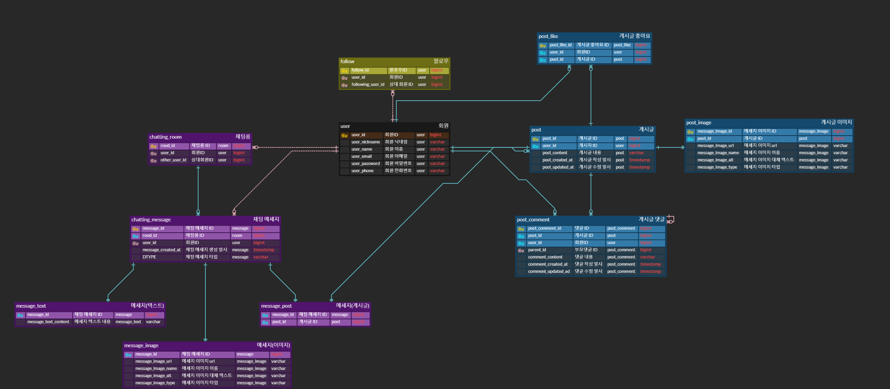

# spring-instagram-20th
CEOS 20th BE study - instagram clone coding

# DB Modeling
인스타그램 전체를 클론 코딩하기 보다는 기능을 최대한 축소시키고자 먼저 기능 정리를 하였다.

> 1. 회원가입
>   - 회원가입을 할 때, user의 email, 실명, 닉네임, 비밀번호, 전화번호 정보를 입력받는다
>   - 전화번호를 제외한 모든 값은 필수로 입력받는다.
>   - 회원정보를 변경하는 경우, 비민번호 인증 후에 email을 제외한 정보를 수정할 수 있다.
>   - 로그아웃 후 로그인을 할 때에는 (email, 비밀번호) 또는 (닉네임, 비밀번호) 또는 (전화번호, 비밀번호)를 입력받는다.
>   - 회원 탈퇴 시 비밀번호 인증 후에 탈퇴할 수 있다.
>   - 기존 인스타그램과 다르게 계정 공개 상태를 결정하지 않고, 모두 ‘전체 공개’ 상태로 한다.
> 2. 팔로우
>   - 회원은 다른 회원은 팔로우할 수 있다.
>   - 모두 전체 공개 상태이므로 팔로우는 요청 즉시 수락된다.
> 3. 게시글
>   - 게시글은 내용, 사진을 포함하여 작성할 수 있다.
>   - 내용은 필수가 아니며, 사진은 필수로 포함해야한다. 
>   - 게시글에 좋아요를 등록할 수 있으며, 이때 좋아요를 누른 회원의 정보가 공개될 수 있다. 
>   - 게시글에 댓글을 등록할 수 있다. 
>   - 게시글에 댓글을 등록할 때, 이미 존재하는 댓글에 대댓글을 등록할 수 있다. 
>   - 게시글은 글을 작성한 회원만 수정, 삭제할 수 있다. 
>   - 댓글은 해당 댓글을 작성한 회원만 수정, 삭제할 수 있다. 
>   - 게시글 또는 댓글을 수정하면 수정한 일시로 일시정보가 업데이트된다. 
>   - 게시글을 작성한 회원이 탈퇴하는 경우 게시글도 자동으로 삭제된다. 
>   - 게시글을 삭제하면 해당 게시글에 있던 좋아요, 댓글 정보도 자동으로 삭제된다.
> 4. DM
>   - 회원은 다른 회원과 1:1 채팅룸을 생성하여 채팅할 수 있다.
>   - 채팅으로는 한번에 텍스트, 이미지, 게시글 공유 중 1가지를 전송할 수 있다.
>   - 채팅은 전송 후 수정, 삭제가 불가능하다.
>   - 채팅은 이전 메세지를 멘션한 후 내용을 작성하여 전송할 수 있다.
>   - 채팅한 상대회원이 탈퇴하더라도 채팅기록은 유지된다.



## POST
`BaseEntity` : `Post`와 `PostComment` Entity에서 `createdAt`, `updatedAt` 속성을 공통적으로 사용하고 있어 `BaseEntity`로 분리하여 구현하였다.

`PostComment` : `PostComment`는 자기 자신을 참조하여 `parent_id`를 foriegn key로 갖는다. 이 값이 NULL인 경우 댓글, 값이 존재하는 경우 대댓글이다.

## MESSAGE
`Message` : Message의 Type이 text, image, post 세가지로 분류되므로, 다음과 같은 상속관계를 갖는다

이때 각각 테이블을 생성하여 저장공간을 효율적으로 사용하기 위하여 조인 전략을 선택하였고, `@Inheritance(strategy=InheritanceType.JOINED)` annotation을 사용하였다.
메세지 조회 기능을 사용할 일이 없다고 예상되어 조인 전략을 선택하였으나 데이터를 저장하는 데에도 성능이 저하될 가능성이 있을지 우려된다. `JOINED`, `SINGLE_TABLE` 둘 중 어느 것이 더 적절할지 고민할 필요가 있다.

`ChattingRoom` : 채팅을 하던 상대방이 인스타그램을 탈퇴하더라도 채팅 기록은 남아있도록 하기 위하여 `ChattingRoom`을 분리하여 구현하였다.

---
# JPA 심화
## 주요 기능
- 회원 가입
- 회원정보 변경
- 로그인
- 회원 탈퇴
- 팔로우
- 게시글 작성
- 게시글 좋아요 등록
- 게시글 댓글 등록
- 게시글, 댓글 수정
- 게시글 삭제
- DM 전송

## UserService
회원가입을 할 때, `nickname`과, `email` 중복을 방지하기 위해 `checkNicknameDuplication`, `checkEmailDuplication`을 사용하였습니다.
```java
@Transactional(readOnly = true)
public void checkNicknameDuplication(String nickname) {
    boolean nicknameDuplicate = userRepository.existsByNickname(nickname);
    if (nicknameDuplicate) {
        throw new IllegalStateException("Nickname already exists");
    }
}
```
```java
@Transactional
public void joinUser(UserJoinRequestDto userDto) {
    checkEmailDuplication(userDto.email());
    checkNicknameDuplication(userDto.nickname());

    User user = userDto.toEntity();
    userRepository.save(user);
}
```
## UserServiceTest
`nickname`에 대한 중복제한이 잘 구현이 되었는지 테스트하기 위하여 `nickname`이 중복인 경우와 아닌 경우를 구분하여 테스트를 진행하였습니다.
```java
// nickname이 중복인 경우 회원가입 테스트
@Test
void joinSameUserTest() {
    //given
    final UserJoinRequestDto request = new UserJoinRequestDto("test", "nickname", "1234", "test@test.com", "01012345678");
    when(userRepository.existsByNickname(request.nickname())).thenReturn(true); // exsitsByNickname = true 반환
    when(userRepository.existsByEmail(request.email())).thenReturn(false);

    //when
    IllegalStateException exception = assertThrows(
        IllegalStateException.class,
        () -> userService.joinUser(request)
    );

    //then
    System.out.println("Test Result: " + exception.getMessage());

    assertEquals("Nickname already exists", exception.getMessage());
    verify(userRepository).existsByNickname(request.nickname());
    verify(userRepository, never()).save(any(User.class));
}
```
## N+1 문제
`jpql` + `@EntityGraph` 혼합 방법을 사용하여 N+1문제를 해결하였습니다.
```java
@Test
@EntityGraph(attributePaths = {"user"})
@Query("select p from Post p")
public void findAllEntityGraph () {
    ...
}
```

# CRUD API
```java
@RestController
@RequiredArgsConstructor
@RequestMapping("/api/posts")
public class PostController {
    private final PostService postService;
    
    @PostMapping
    public ResponseEntity<Void> createPost(@RequestBody final PostCreatRequestDto requestDto, final String username) {
        postService.createPost(requestDto, username);
        return ResponseEntity.status(HttpStatus.CREATED).build();
    }

    @GetMapping
    public ResponseEntity<List<PostListResponseDto>> getAllPosts() {
        final List<PostListResponseDto> posts = postService.getAllPosts();
        return ResponseEntity.ok().body(posts);
    }
}
```


# Global Exception
1. `exception code`, `success code` 정의
    ```java
    BAD_REQUEST_ERROR(HttpStatus.BAD_REQUEST, "Bad Request Exception"),
    NOT_FOUND_POST(HttpStatus.NOT_FOUND, "게시글이 존재하지 않습니다"),
    ```
    ```java
    SELECT_SUCCESS(200, "200", "SELECT SUCCESS"),
    DELETE_SUCCESS(200, "200", "DELETE SUCCESS"),
    INSERT_SUCCESS(201, "201", "INSERT SUCCESS"),
    UPDATE_SUCCESS(204, "204", "UPDATE SUCCESS");
    ```
2. service 예외 처리
    ```java
    public PostResponseDto getPost(final Long postId) {
        final Post post = postRepository.findById(postId)
                .orElseThrow(() -> new NotFoundException(ExceptionCode.NOT_FOUND_POST.getMessage()));
        final List<PostComment> commentList = commentRepository.findByPost(post);
    
        return PostResponseDto.of(post, commentList);
    }
    ```
   게시글을 조회했을 때 해당 게시글이 존재하지 않을 때 `NotFoundException`을 통해 설정해둔 `NOT_FOUND_POST`에 대한 exception message를 표시한다.
# API 명세서

## 개발 전 명세서 ?

DTO를 생성할 때에도, CRUD api 를 생성하려고 할 때에도, 기능들에 대한 정리가 안되어있다보니 어디부터 손대할지 막막하고 개발 도주에 수정할 것들이 많아져서 뒤죽박죽이 되는 느낌이었다. 이를 해소하고자 API 명세서를 작성하는 방법부터 찾아보았는데 우선 내가 개발하는 데에 쓰는 용도로 notion을 이용해서 제작하였다.

다음과 같은 형식으로 기능, http method, api path, token, 각 기능에 필요한 DTO를 정리하려고 하였다.


## 협업 때 사용할 명세서

노션은 내가 보려고 한거고.. 실제로 노션을 쓰면 실제 코드와 동기화가 안되기 때문에 비효율적 + 에러핸들링 어려움의 문제가 있을 것이라고 생각하였다.

코드 기반으로 api 명세서를 생성하는 swagger, spring REST docs 에 대해 찾아보았다

1. swagger
- 장점 : swagger-ui 문서에서 api test 가능
- 단점 : 코드에 어노테이션을 추가해야 하므로 서비스코드와 api 명세서 관리가 혼합된다
2. spring REST docs
- 장점 : 코드에 영향 X
- 단점 : 테스트 코드를 기반으로 생성되므로 모든 테스트 코드를 작성해야한다

프론트 개발을 할 때 swagger-ui를 사용해보았는데 ui가 그리 보기 편하진 않았어서.. REST docs를 사용하고 싶었지만..! 테스트를 만들어서 실행하는게 익숙하지 않기 때문에 처음에는 swagger를 시도해보기로 결정하였다.

## swagger-ui
```java
@Configuration
@OpenAPIDefinition(
        info = @Info(
                title = "API Test",
                description = "Instagram clone coding API 명세서",
                version = "v1"
        ),
        servers = {@Server(url = "http://localhost:8080", description = "local server")}
)
public class SwaggerConfig {

    @Bean
    public OpenAPI openAPI() {
        return new OpenAPI()
                .components(new Components());
    }
}
```
SwaggerConfig 파일에서 로컬 서버로 url 설정을 해둔 후, `@Tag`, `@Operation` 등의 어노테이션을 사용하여 각 api 동작이 swagger-ui와 연동되도록 한다.


# Controller 통합 테스트
에러 발생 시 설정해둔 exception status, message가 표시되는 것을 확인하였다.


# JWT 인증(Authentication) 방법
## Cookie
- 보안이 좋지 않음


## Cookie + Session
> cookie : 브라우저에 저장

> session : 서버에 저장
- cookie만 사용하는 것에 비해 보안 유지가 가능함
  - session id가 탈취되더라도 session data를 전부 지워버리는 방법으로 대처 가능
- 요청을 보낼 때마다 session id를 조회해야함
- 사용자가 많아질수록 메모리를 차지함
- stateful -> scale out이 번거로움


❗️cookie, session의 단점을 보완하는 방법 → JWT !!

## JWT (Access Token + Refresh Token)
인증에 필요한 정보들을 Token에 담아 암호화시켜 사용하는 방식

**서명된 토큰 → stateless**

구성요소
1. Header
   ```json
   {
     "typ": "JWT",
     "alg": "HS512"
   }
   ```
2. Payload
   ```json
   {
     "sub": "1",
     "iss": "ori",
     "exp": 1636989718,
     "iat": 1636987918
   }
   ```
   - iss (Issuer) : 토큰 발급자
   - sub (Subject) : 토큰 제목 - 토큰에서 사용자에 대한 식별값이 됨
   - aud (Audience) : 토큰 대상자
   - exp (Expiration Time) : 토큰 만료 시간
   - nbf (Not Before) : 토큰 활성 날짜 (이 날짜 이전의 토큰은 활성화 되지 않음을 보장)
   - iat (Issued At) : 토큰 발급 시간
   - jti (JWT Id) : JWT 토큰 식별자 (issuer가 여러명일 때 이를 구분하기 위한 값)
   - 식별을 위해 필요한 정보만 담고, 민감한 정보들을 담지 않도록 주의

3. Signature

   header를 디코딩한 값, payload를 디코딩한 값을 합치고 이를 서버가 가지고 있는 개인키(your-256-bit-secret)를 가지고 암호화 되어있는 상태

**jwt는 cookie와 session의 단점 보완**
- 이미 토큰 자체가 인증된 정보이기 때문에 세션 저장소와 같은 별도의 인증 저장소가 필수적으로 필요하지 않음
- 세션과는 다르게 클라이언트의 상태를 서버가 저장하지 않아도됨
- signature를 공통키 개인키 암호화를 통해 막아두었기 때문에 데이터에 대한 보완성 향상

❓그렇다면 jwt의 단점은 없을까?

> 토큰이 탈취당하면 만료될 때까지 대처가 불가능 !

이를 해결하기 위해서는 Expiration Time(만료시간)을 짧게 설정할 수 있다

만료시간이 짧은 경우 UX적으로 불편함. 이을 해결하고 짧은 만료시간을 보완하기 위한 재발급 방식
1. Sliding Session : 특정한 서비스를 계속 사용하고 있는 특정 유저에 대해 만료 시간을 연장 시켜주는 방법
2. Refresh Token : JWT를 처음 발급할 때 Access Token과 함께 Refresh Token이라는 토큰을 발급하는 방법


```text
1. 사용자가 로그인한다.
2. 서버는 회원 확인 후 서명된 JWT 생성하여 클라이언트에 응답한다.
이때 Access Token과 Refresh Token을 같이 전달한다.
3. 사용자가 요청할 때마다 Access Token와 함께 보낸다.
4. 서버에서 Access Token을 검증한다.
5. 검증이 완료되면 응답을 보낸다.
6. 🚨 Access Token 만료되었다.
7. 사용자가 Access Token과 함께 데이터를 요청한다.
8. 서버에서 Access Token이 만료된 것을 확인한다.
9. 만료되었다는 것을 알려주는 응답을 보낸다.
10. 사용자는 만료 응답을 받고 Access Token과 Refresh Token을 같이 담아 발급 요청을 보낸다.
11. Refresh Token을 확인한 후 Access Token을 발급한다.
12. Access Token과 함께 응답을 보낸다.
```

## OAuth (Open Authorization)


# Docker
## trouble shooting

### Error message

```json
The last packet sent successfully to the server was 0 milliseconds ago. The driver has not received any packets from the server.

Caused by: com.mysql.cj.exceptions.CJCommunicationsException: Communications link failure
Caused by: java.net.ConnectException: Connection refused
```

### 문제 원인 및 시도

1. `useSSL=false` 설정

   접속하려는 mysql 데이타베이스의 SSL설정의 기본값이 true인 경우, 접속하려는 클라이언트가 ssl로 접속하지 않고, ssl이 아닌 일반적인 연결로 접속하기 때문에 발생한다. mysql서버쪽에서는 유효하지 않는 패킷이 넘어오는 것이 때문에 오류를 낸다고 생각하면 된다.

   JDBC 접속시에 SSL연결이 아닌 일반적인 연결(물론 보안이 약함)이라고 명시적으로 설정을 하면 된다.

   - SSL 이란 Secure Socket Layer의 약자로서 클라이언트와 서버가 통신을 할때 암호화를 통해서 보안을 높힌 접속을 말한다.

2. mysql container 실행을 안해둔 상태였다.. 그런데 실행하려고 보니? 이미 3306포트를 사용중이라고 떴다
   - `lsof -i :3306` 명령어를 통해 3306 포트를 사용중인지 확인하였으나 없었다 .. 
   - 무언가 문제가 생긴 것 같아 `docker system prune -a` 명령어로 모든 캐시를 삭제한 후 다시 mysql container 생성 → 성공!

3. 이후 다시 application image를 빌드한 후 실행하였으나 같은 에러 발생 ..
   트러블 슈팅 실패 ... 계속 시도 중 .........